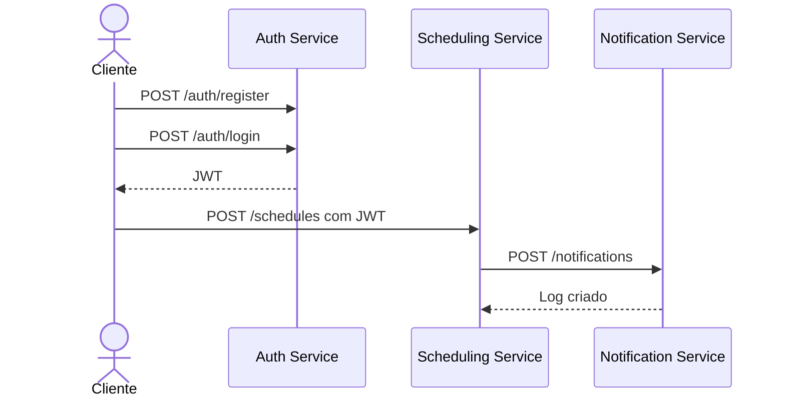

# Relatorio Academico: PoolCare Scheduler

## 1. Introducao

O PoolCare Scheduler e um sistema de agendamento de servicos de manutencao de piscinas. A proposta demonstra conceitos de Engenharia de Software em uma solucao simples o suficiente para ser implementada por um unico aluno, mas organizada com praticas profissionais: Clean Architecture, microsservicos, SOLID, Design Patterns, TDD, BDD, Docker e deploy em nuvem.

## 2. Problema

Clientes precisam solicitar visitas de piscineiros, acompanhar seus agendamentos e cancelar visitas. Prestadores precisam visualizar a agenda, confirmar atendimentos, concluir servicos e consultar historico.

## 3. Objetivos

- Criar um backend em Node.js, TypeScript e Express.
- Separar responsabilidades em tres microsservicos.
- Demonstrar arquitetura limpa e baixo acoplamento.
- Automatizar execucao local com Docker Compose.
- Disponibilizar roteiro de deploy no Render.
- Fornecer testes unitarios, integracao e BDD.

## 4. Arquitetura

A arquitetura usa tres microsservicos:

- Auth Service: cadastro, login e JWT.
- Scheduling Service: agendamentos e regras de negocio.
- Notification Service: notificacoes simuladas e logs.

Fluxo principal:



## 5. Microsservicos

Auth Service:

- Entidade: `User`.
- Casos de uso: `RegisterUserUseCase`, `LoginUseCase`.
- Infraestrutura: `BcryptPasswordHasher`, `JwtTokenService`, `InMemoryUserRepository`.
- Apresentacao: `AuthController`, rotas Express.

Scheduling Service:

- Entidade: `Schedule`.
- Casos de uso: criar, cancelar, confirmar, concluir e listar.
- Infraestrutura: `InMemoryScheduleRepository`, `NotificationObserver`.
- Apresentacao: `ScheduleController`, middleware JWT e rotas Express.

Notification Service:

- Entidade: `NotificationLog`.
- Casos de uso: enviar notificacao e listar logs.
- Infraestrutura: `ConsoleEmailSender`, `InMemoryNotificationLogRepository`.
- Apresentacao: `NotificationController`.

## 6. Clean Architecture

Cada servico possui:

- Domain: entidades, contratos e regras de negocio puras.
- Application: casos de uso e portas de entrada.
- Infrastructure: implementacoes externas, como hash, JWT, envio simulado e repositories.
- Presentation: controllers, middlewares e rotas HTTP.

A dependencia aponta para dentro. Controllers dependem de casos de uso; casos de uso dependem de interfaces; interfaces pertencem ao dominio ou aplicacao; detalhes ficam na infraestrutura.

## 7. SOLID

SRP:

- `RegisterUserUseCase` apenas cadastra usuarios.
- `JwtTokenService` apenas cria tokens.
- `ScheduleController` apenas adapta HTTP para casos de uso.

OCP:

- `PricingStrategy` permite adicionar novas regras de preco sem alterar `CreateScheduleUseCase`.
- `EmailSender` permite trocar console por SMTP ou SendGrid sem mudar `SendNotificationUseCase`.

LSP:

- Qualquer classe que implemente `ScheduleRepository` pode substituir `InMemoryScheduleRepository`.
- Qualquer `EmailSender` pode substituir `ConsoleEmailSender` mantendo o contrato.

ISP:

- `PasswordHasher` expoe apenas `hash` e `compare`.
- `TokenService` expoe apenas `sign`.
- `NotificationLogRepository` expoe apenas operacoes de log.

DIP:

- Casos de uso dependem de interfaces, nao de Express, PostgreSQL, JWT ou bcrypt.
- A composicao concreta acontece em `app.ts`.

## 8. Design Patterns

Factory Pattern:

- Problema: evitar criacao espalhada de objetos complexos.
- Motivacao: manter validacoes de criacao concentradas.
- Implementacao: `ScheduleFactory` cria `Schedule`; `NotificationFactory` cria `NotificationLog`.
- Beneficio: objetos nascem validos e o caso de uso fica menor.

Strategy Pattern:

- Problema: calculos de preco podem variar.
- Motivacao: preco regular, emergencial, recorrente ou promocional nao deve alterar o caso de uso.
- Implementacao: `PricingStrategy`, `RegularPricingStrategy`, `EmergencyPricingStrategy`.
- Beneficio: novas estrategias entram por extensao.

Repository Pattern:

- Problema: casos de uso nao devem conhecer banco, memoria ou ORM.
- Motivacao: facilitar testes e troca de persistencia.
- Implementacao: `UserRepository`, `ScheduleRepository`, `NotificationLogRepository`.
- Beneficio: testes usam memoria; producao pode usar PostgreSQL.

Observer Pattern:

- Problema: Scheduling nao deve acoplar diretamente suas regras a notificacoes.
- Motivacao: eventos de agendamento podem disparar efeitos externos.
- Implementacao: `ScheduleEventPublisher` e `NotificationObserver`.
- Beneficio: novos observers podem ser adicionados sem mudar os casos de uso.

## 9. Clean Code

Praticas aplicadas:

- Metodos curtos: `Schedule.confirm`, `Schedule.cancel`, `Schedule.complete`.
- Nomes significativos: `CreateScheduleUseCase`, `NotificationObserver`, `PasswordHasher`.
- Baixo acoplamento: controllers nao instanciam infraestrutura.
- Alta coesao: cada classe tem uma responsabilidade.
- Eliminacao de duplicacao: repositories e factories centralizam operacoes repetidas.
- Comentarios apenas quando necessarios: o codigo privilegia nomes claros.

Antes da refatoracao:

```ts
app.post("/schedule", async (req, res) => {
  const item = {
    id: crypto.randomUUID(),
    clientId: req.body.clientId,
    providerId: req.body.providerId,
    status: "REQUESTED"
  };
  schedules.push(item);
  await fetch("http://notification/notifications", { method: "POST", body: JSON.stringify(item) });
  res.json(item);
});
```

Depois da refatoracao:

```ts
const result = await createSchedule.execute({
  ...request.body,
  clientId: request.user!.sub
});
response.status(201).json(result);
```

Ganho: a rota apenas adapta HTTP. Criacao, preco, persistencia e notificacao ficam em classes coesas.

## 10. TDD

Ciclo aplicado:

- Red: escrever teste esperando cadastro, agendamento ou notificacao.
- Green: implementar o menor codigo para passar.
- Refactor: extrair interfaces, factories e strategies.

Exemplo de teste Jest:

```ts
it("creates a schedule and publishes an event", async () => {
  const schedules = new InMemoryScheduleRepository();
  const events = new ScheduleEventPublisher();
  const observer = { notify: jest.fn() };
  events.subscribe(observer);

  const useCase = new CreateScheduleUseCase(
    schedules,
    new ScheduleFactory(),
    new RegularPricingStrategy(),
    events
  );

  const result = await useCase.execute({
    clientId: "client-1",
    providerId: "provider-1",
    serviceDate: "2026-07-10T14:00:00.000Z",
    address: "Rua Azul, 10",
    basePrice: 120
  });

  expect(result.schedule.status).toBe("REQUESTED");
  expect(observer.notify).toHaveBeenCalled();
});
```

## 11. BDD

Foram criados 12 cenarios Gherkin:

- Cliente cria conta com sucesso.
- Usuario realiza login com sucesso.
- Login com senha invalida.
- Cliente agenda visita com sucesso.
- Cliente consulta seus agendamentos.
- Cliente cancela agendamento.
- Prestador confirma atendimento.
- Prestador conclui atendimento.
- Prestador consulta historico.
- Cliente nao cancela atendimento de outro cliente.
- Sistema envia notificacao simulada.
- Prestador consulta logs de notificacao.

Exemplo:

```gherkin
Feature: Agendamento

Scenario: Cliente agenda visita com sucesso
  Given um cliente autenticado
  When solicita um agendamento
  Then o sistema deve registrar a visita
```

## 12. Docker

Cada microsservico possui `Dockerfile` proprio. O `docker-compose.yml` cria:

- Tres bancos PostgreSQL.
- Tres containers de aplicacao.
- Rede `poolcare-network`.
- Volumes persistentes por banco.
- Variaveis de ambiente por servico.

Comando:

```bash
docker compose up --build
```

## 13. Deploy

Deploy escolhido: Render.

Motivos:

- Suporte a web services Docker.
- Bancos PostgreSQL gerenciados.
- Deploy integrado com GitHub.
- Configuracao declarativa via `render.yaml`.

O deploy e configurado pelo arquivo `render.yaml`, mantendo a infraestrutura declarativa no repositorio.

## 14. Conclusao

O projeto entrega uma arquitetura academica completa, com microsservicos claros, separacao de camadas, aplicacao explicita de SOLID, quatro Design Patterns, testes automatizados, cenarios BDD, Docker Compose e roteiro de deploy. A solucao permanece pequena o bastante para um unico aluno implementar e apresentar, mas cobre os principais conceitos exigidos por uma disciplina de Engenharia de Software.
